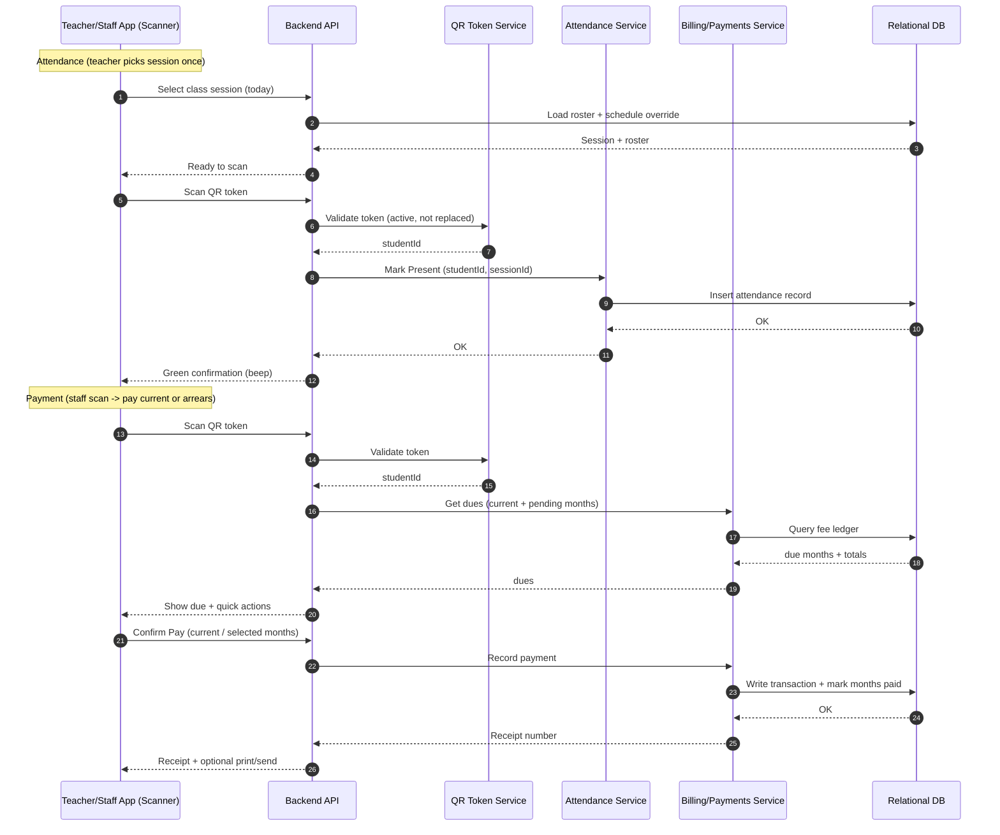

# Tuition Center System — Architecture (High Level)

This is a practical, scalable architecture for **Web + Android + iOS** with fast **QR-based attendance and payments**, plus reporting and automated retention.

## 1) Logical Architecture (Services + Data)

```mermaid
flowchart TB
  %% Clients
  subgraph Clients[Client Apps]
    Web[Web App\n(Admin/Staff)]
    TApp[Mobile App\n(Teacher)]
    PApp[Mobile App\n(Student/Parent)]
  end

  %% Identity
  subgraph Identity[Identity & Access]
    IdP[Identity Provider (OIDC)\nUsers / Roles / Login]
  end

  %% Backend
  subgraph Backend[Backend API]
    API[API Gateway / BFF\n(REST/GraphQL)]

    subgraph Domain[Domain Modules]
      Users[Users & Roles]
      Master[Teachers / Grades / Class Groups]
      Schedule[Scheduling\n(permanent + temporary overrides)]
      Enroll[Enrollment]
      QR[QR Token Service\n(issue/rotate/validate)]
      Attendance[Attendance Service\n(scan -> present/late/absent)]
      Billing[Billing & Payments\n(monthly fees, arrears, receipts)]
      Expenses[Expenses\n(electricity/water/other)]
      Reports[Reports\n(students/attendance/payments/financial)]
      Audit[Audit Log]
    end

    Jobs[Background Jobs / Scheduler\n(monthly fee generation, retention cleanup)]
    Notify[Notification Adapter\n(SMS/Email/WhatsApp optional)]
  end

  %% Data
  subgraph Data[Data Stores]
    RDB[(Relational DB\nPostgreSQL/MySQL)]
    Files[(Object Storage\nreceipts, exports, attachments)]
    Cache[(Cache\noptional: Redis)]
  end

  %% Flows
  Web --> API
  TApp --> API
  PApp --> API

  Web --> IdP
  TApp --> IdP
  PApp --> IdP
  API --> IdP

  API --> Users
  API --> Master
  API --> Schedule
  API --> Enroll
  API --> QR
  API --> Attendance
  API --> Billing
  API --> Expenses
  API --> Reports
  API --> Audit

  Domain --> RDB
  Jobs --> RDB
  Billing --> Files
  Reports --> Files
  API --> Cache

  Jobs --> Notify
  API --> Notify
```

## 2) QR “Fast Lane” Data Flow (Queue Mode)



## 3) Deployment View (How it typically runs)

```mermaid
flowchart LR
  subgraph Internet[Internet]
    Users[Users on Web/Mobile]
  end

  subgraph Edge[Edge]
    CDN[CDN + WAF\n(for Web assets)]
  end

  subgraph App[Application]
    WebHost[Web Hosting\n(static web + admin portal)]
    APISvc[Backend API Service\n(container/app server)]
    Worker[Background Worker\n(scheduled jobs)]
  end

  subgraph Data[Data]
    DB[(Relational DB)]
    Blob[(Object Storage)]
    MQ[(Queue/Event Bus\noptional)]
  end

  subgraph External[External Services]
    IdP[Identity Provider]
    SMS[SMS/Email/WhatsApp Provider]
  end

  Users --> CDN --> WebHost
  Users --> APISvc

  WebHost --> IdP
  APISvc --> IdP

  APISvc --> DB
  Worker --> DB

  APISvc --> Blob
  Worker --> Blob

  APISvc --> MQ
  Worker --> MQ

  APISvc --> SMS
  Worker --> SMS
```

## Notes (ties to your requirements)

- **Several teachers / grades / multiple classes:** handled via Master Data + Scheduling + Enrollment modules.
- **Teacher charging models:** handled via Billing (per-student / fixed / free) + teacher statements.
- **Free cards + pending fees:** fee ledger supports “waived” months and arrears aging.
- **Attendance retention rules:** enforced by Background Jobs (3 months delete only if paid; if paid late, delete 30 days after payment).
- **Fast queue operations:** scanner app calls a single API endpoint per scan; duplicate-scan prevention can be enforced server-side.
