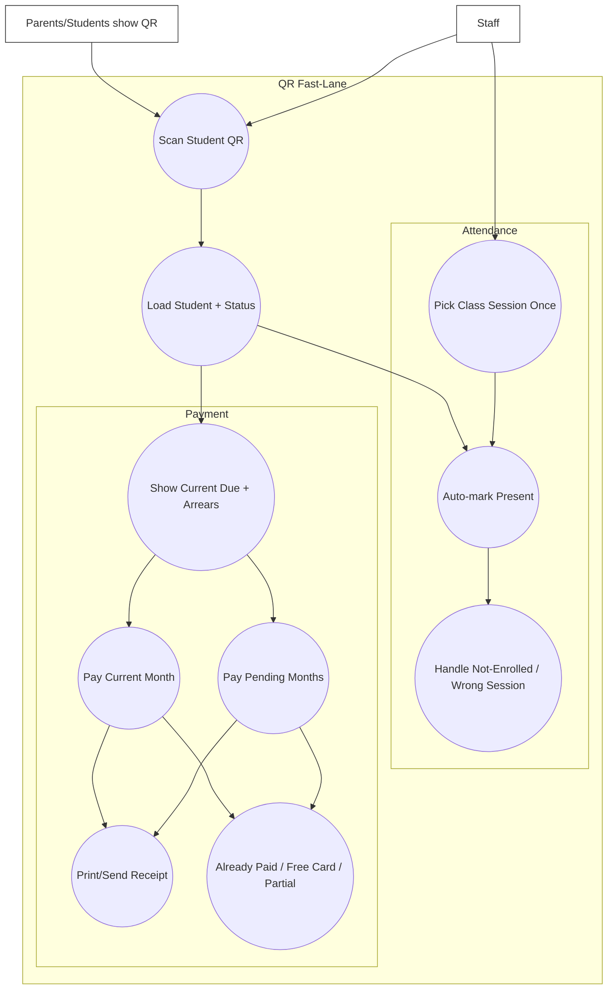

# Tuition Center Management System — Use Cases (Diagrams)

This document contains the use-case diagrams for the tuition center system.

## 1) High-Level Use Case Diagram

```mermaid
flowchart LR
  %% Actors
  Admin[Admin / Owner]
  Staff[Front Desk / Staff]
  Parent[Parents / Students]
  Scheduler[[System Scheduler]]

  %% System boundary
  subgraph SYS[Tuition Center Management System]
    UC_Login((Login))

    %% Setup
    UC_Teachers((Manage Teachers))
    UC_Charging((Configure Teacher Charging Model))
    UC_Grades((Manage Grades))
    UC_Classes((Manage Class Groups / Batches))
    UC_SchedulePerm((Manage Permanent Schedule))
    UC_ScheduleTemp((Temporary Schedule Change))

    %% Students
    UC_StudentProfile((Create/Update Student Profile))
    UC_Enroll((Enroll Student to Class Group))
    UC_FreeCard((Issue/Revoke Free Card))

    %% QR
    UC_IssueQR((Issue/Replace Student QR))
    UC_ScanBase((Scan QR to Identify Student))

    %% Attendance
    UC_SelectSession((Select Class Session))
    UC_AttBulk((Bulk Scan Attendance))
    UC_AttEdit((Edit Attendance))

    %% Payments
    UC_PayScan((Scan QR to Take Payment))
    UC_PayCurrent((Pay Current Month))
    UC_PayArrears((Pay Pending Months))
    UC_Receipt((Send/Print Receipt))

    %% Finance
    UC_Expenses((Record Expenses))
    UC_TeacherBill((Generate Teacher Charges))
    UC_TeacherPay((Record Teacher Payments))
    UC_Dashboard((Financial Dashboard))

    %% Reports
    UC_RepStudents((Student Reports))
    UC_RepAttendance((Attendance Reports))
    UC_RepPayments((Payment / Pending / Late Reports))

    %% Automation
    UC_GenMonthly((Generate Monthly Fees))
    UC_Retention((Attendance Retention & Deletion))
    UC_Audit((Audit Log))
  end

  %% Access relationships
  Admin --> UC_Login
  Staff --> UC_Login
  Parent --> UC_Login

  %% Admin / Staff setup
  Admin --> UC_Teachers
  Admin --> UC_Charging
  Admin --> UC_Grades
  Admin --> UC_Classes
  Admin --> UC_SchedulePerm
  Admin --> UC_ScheduleTemp
  Staff --> UC_StudentProfile
  Staff --> UC_Enroll
  Staff --> UC_FreeCard

  %% QR issuance
  Staff --> UC_IssueQR
  Admin --> UC_IssueQR

  %% Attendance QR flow
  Staff --> UC_SelectSession
  Staff --> UC_AttBulk
  Staff --> UC_AttEdit

  UC_AttBulk -. includes .-> UC_ScanBase
  UC_SelectSession -. supports .-> UC_AttBulk

  %% Payments QR flow
  Staff --> UC_PayScan
  UC_PayScan -. includes .-> UC_ScanBase
  UC_PayScan -. includes .-> UC_PayCurrent
  UC_PayScan -. extends .-> UC_PayArrears
  UC_PayScan -. includes .-> UC_Receipt

  %% Parent/Student views
  Parent --> UC_Dashboard
  Parent --> UC_RepPayments
  Parent --> UC_RepAttendance

  %% Finance + reports
  Staff --> UC_Expenses
  Admin --> UC_Expenses
  Admin --> UC_TeacherBill
  Staff --> UC_TeacherPay
  Admin --> UC_Dashboard
  Staff --> UC_Dashboard

  Admin --> UC_RepStudents
  Staff --> UC_RepStudents
  Admin --> UC_RepAttendance
  Staff --> UC_RepAttendance
  Admin --> UC_RepPayments
  Staff --> UC_RepPayments

  %% Automation
  Scheduler --> UC_GenMonthly
  Scheduler --> UC_Retention

  %% Cross-cutting
  UC_AttBulk -. logs .-> UC_Audit
  UC_AttEdit -. logs .-> UC_Audit
  UC_PayScan -. logs .-> UC_Audit
  UC_Expenses -. logs .-> UC_Audit
```

## 2) QR Fast-Lane Diagram (Queue Mode)

